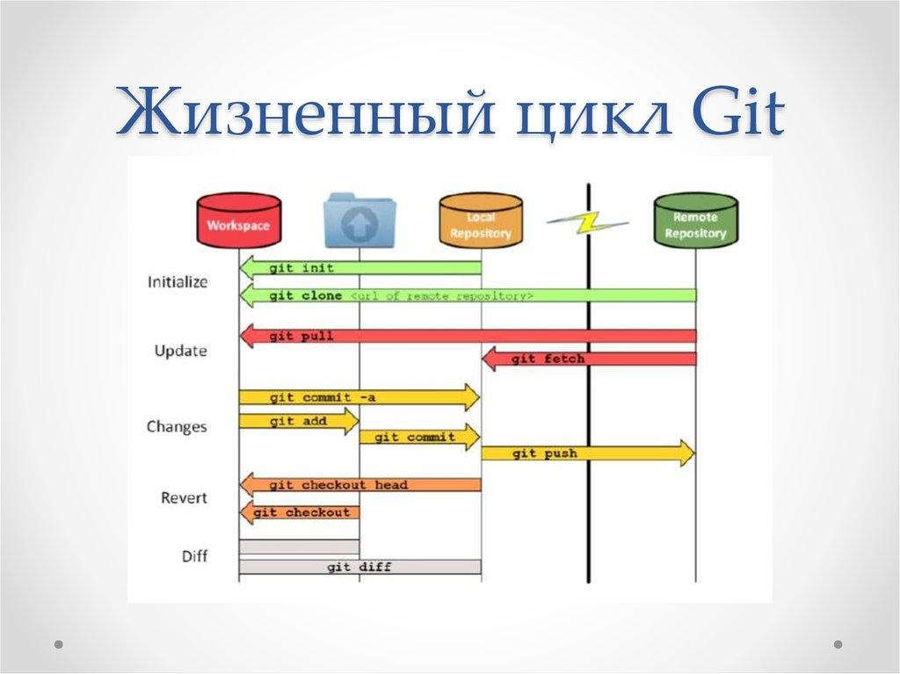
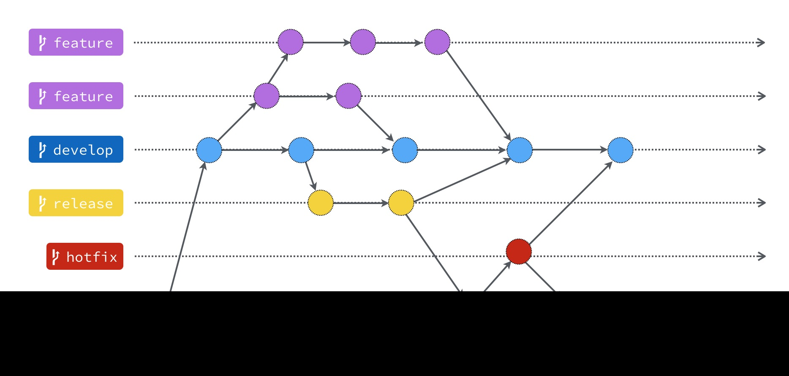
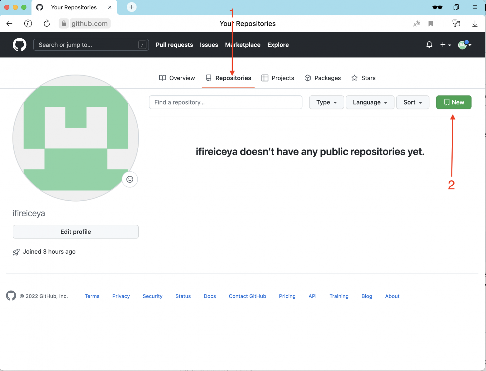
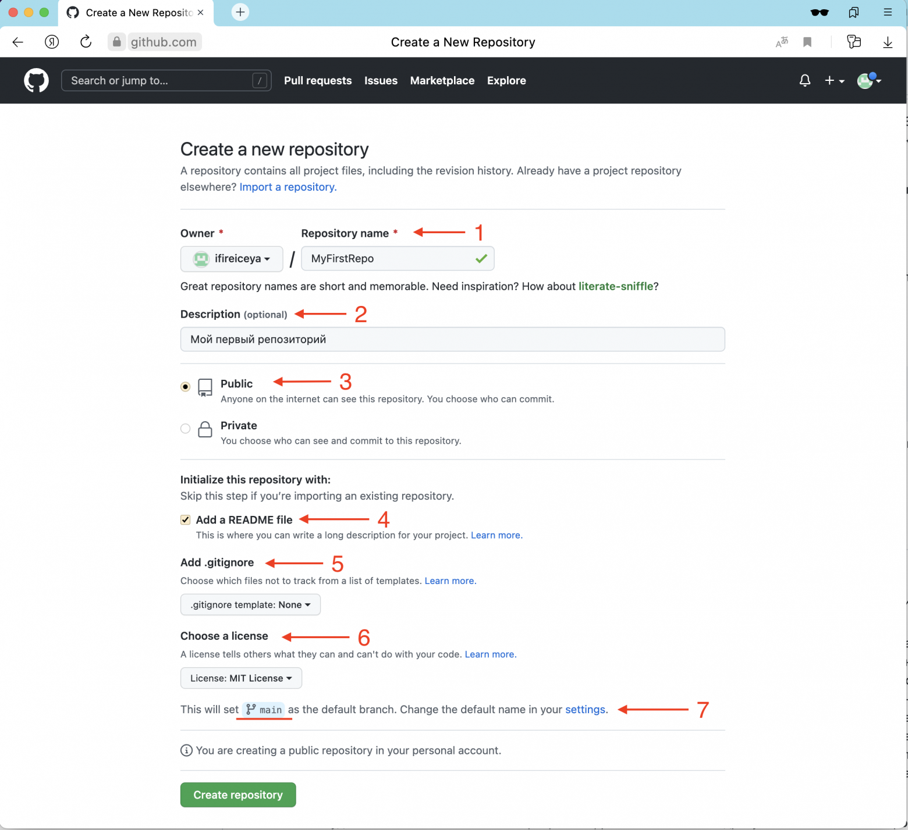

# Инструкция для работы с Git и удалёнными репозиториями

321

## Что такое Git?
Git - это одна из реализаций распределённых систем контроля версий, имеющая как и локальные, так и удалённые репозитории. Является самой популярной реализацией систем контроля версий в мире. Проект был создан Линусом Торвальдсом для управления разработкой ядра Linux, первая версия выпущена 7 апреля 2005 года.

**Схема системы**

## Подготовка репозитория
Для создание репозитория необходимо выполнить команду *git init*  в папке с репозиторием и у Вас создаться репозиторий (появится скрытая папка .git)

## Создание коммитов

### Git add
Для добавления измений в коммит используется команда *git add*. Чтобы использовать команду *git add* напишите *git add <имя файла>*

### Просмотр состояния репозитория
Для того, чтобы посмотреть состояние репозитория используется команда *git status*. Для этого необходимо в папке с репозиторием написать *git status*, и Вы увидите были ли измения в файлах, или их не было.

### Создание коммитов
Для того, чтобы создать коммит(сохранение) необходимо выполнить команду *git commit*. Выполняется она так: *git commit -m "<сообщение к коммиту>*. Все файлы для коммита должны быть ***ДОБАВЛЕНЫ*** и сообщение к коммиту писать ***ОБЯЗАТЕЛЬНО***.

## Перемещение между сохранениями
Для того, чтобы перемещаться между коммитами, используется команда *git checkout*. Используется она в папке с пепозиторием следующим образом: *git checkout <номер коммита>*

## Журнал изменений
Для того, чтобы посмтреть все сделанные изменения в репозитории, используется команда *git log*. Для этого достаточно выполнить команду *git log* в папке с репозиторием

## Ветки в Git

### Создание ветки

Для того, чтобы создать ветку, используется команда *git branch*. Делается это следующим образом в папке с репозиторием: *git branch <название новой ветки>*

## Слияние веток

Для того чтобы дабавить ветку в текущую ветку используется команда *git merge <name branch>*

## Удаление веток
Для удаления ветки ввести команду "git branch -d 'name branch'"

git merge

# Работа с удаленным депозиторием

1. Зарегистрируйтесь на GitHub: задайте логин, почту и придумайте пароль

2. Для того чтобы сервис определил, кто вы и имеете ли право работать с тем или иным репозиторием, нужно представиться — пройти процесс аутентификации.

# Начало работы

Cоздание репозитория 

* (1) Repository name: имя репозитория.

* (2) Description: описание репозитория.

* (3) Тип репозитория: Public (публичный) или Private (приватный). Сейчас выберем публичный — кто угодно может видеть содержимое репозитория.

* (4) Ставим галку на «Создать README файл». В этом файле в формате MarkDown описывают проект или прочую документацию. Именно содержимое этого файла можно увидеть, когда заходим на главную страницу репозитория. 

* (5) Нажимаем кнопку «Create repository»

## Команда git clone
Клонирует переданный репозиторий на ваш компьютер

## Команда git pull
Получает изменения из переданного удаленного репозитория и обновляет рабочую копию в соответствии с удаленным репозиторием. 

## Команда git push
Загружает все изменения с текущей ветки в удаленный репозиторий

# Создание репозитория на GitHub
Прежде всего вам необходимо зарегистрироваться на GitHub, но это довольно тривиальный процесс, так что его мы здесь опустим. После регистрации вы попадете на главную страницу. На ней будут отображаться действия людей, на которых вы подписались и обновления в репозиториях, которые вы добавили в избранное.

Чтобы создать свой репозиторий, нажмите на зеленую кнопку New

